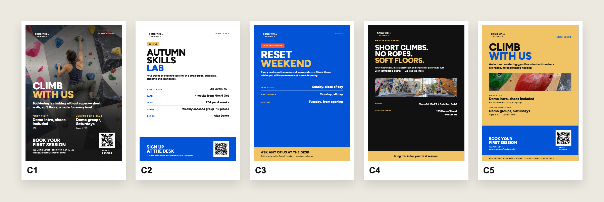

# Sandbox Print Kit

[English](README.md) · [Русский](README.ru.md)

Локальный комплект, который превращает один материал в пять аккуратных композиций плаката — от DL до A3. На выходе получаются готовые к печати PDF с вылетами 5 мм и, при необходимости, метками реза.



## Что умеет

- Создаёт пять редактируемых HTML-вариантов плаката в выбранном формате.
- Хранит фотографии, шрифты и QR-коды локально в каждой рабочей копии.
- Проверяет пропущенные факты, заглушки в QR, обрезанный текст и пересечения.
- Экспортирует одностраничные PDF со встроенными шрифтами, вылетами и метками реза.
- Проверяет геометрию PDF, качество изображений, читаемость QR и совпадение макетов по линии реза.

Комплект сделан по заказу **Sandbox Bouldering**, а здесь показан на вымышленном бренде **Demo Wall Climbing**. Логотип, фотографии и адрес клиента в репозиторий не входят. Подробнее — в [кейсе проекта](https://kabago.ru/cases/sandbox-print/).

## Что понадобится

- Mac с Apple Silicon. Другие платформы не проверялись.
- Node.js 20.20.0.
- Python 3.12.13.
- Интернет при первой установке зависимостей и Chromium; после этого рендеринг работает локально.

Zapf Dingbats, из которого берётся знак ✳ в C5, входит в macOS и отдельно не распространяется. Figtree лежит в комплекте по лицензии SIL Open Font License.

## Быстрый старт

```sh
npm ci
node scripts/install-browser.mjs
python3 scripts/install-tools.py
npm run v2:variants -- --format A4 --name my-poster --photo "/path/to/photo.png"
```

Откройте `work/my-poster-a4/index.html`, заполните пять рабочих плакатов, затем следуйте инструкции [по созданию и экспорту](docs/usage.md), чтобы проверить и выгрузить выбранную композицию.

Справочные материалы: [каталог композиций](docs/catalog.md), [правила заполнения](docs/filling-guide.md), [работа с дизайном и активами](docs/design-guide.md), [печать и контроль качества](docs/print-and-qa.md).

## Что не входит

- Логотип, фотографии, адреса, фотобанк и внутренние документы клиента.
- Готовые тексты для вашего бизнеса: имена программ, цены, адрес и остальной текст в шаблонах — явно вымышленные примеры.
- Хостинг, визуальный редактор, услуги печати или согласование с типографией.
- Системные шрифты macOS, включая Zapf Dingbats.

Для реальной работы добавьте собственные тексты и фотографии с подтверждёнными правами. Три фотографии в комплекте и текстовый знак Demo Wall Climbing созданы для этой публичной демонстрации и входят под лицензию MIT репозитория.

## Лицензия

Код, шаблоны, документация и оригинальные демо-активы доступны по [лицензии MIT](LICENSE). У Figtree и программных зависимостей собственные лицензии; см. [THIRD_PARTY_NOTICES.md](THIRD_PARTY_NOTICES.md). Происхождение активов описано в [ASSET_PROVENANCE.md](docs/ASSET_PROVENANCE.md).
