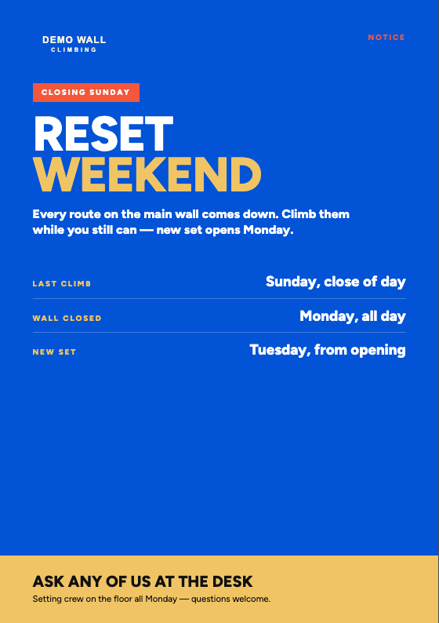
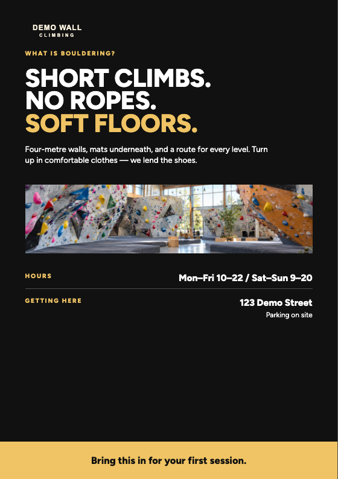

# Choose a composition and size

[Start](../README.md) · [Choose a composition](catalog.md) · [Create & export](usage.md) · [Edit design & assets](design-guide.md) · [Fill the variants](filling-guide.md) · [Print & QA](print-and-qa.md)

The package contains five client-approved visual compositions. Choose a size from the table below, then run `v2:variants` to create all five compositions for that size. Open their `index.html` and choose by eye.

| Format | Trim size | With 5 mm bleed |
|---|---:|---:|
| DL | 99 × 210 mm | 109 × 220 mm |
| A6 | 105 × 148 mm | 115 × 158 mm |
| A5 | 148 × 210 mm | 158 × 220 mm |
| A4 | 210 × 297 mm | 220 × 307 mm |
| A3 | 297 × 420 mm | 307 × 430 mm |

Example:

```sh
npm run v2:variants -- --format A5 --name my-poster --photo "/path/to/your-photo.png"
```

For a single composition instead, [Create & export](usage.md#create-one-working-poster) documents `html:new`.

Bleed adds 5 mm on every side; the crop-mark PDF has additional service area. **External** means public-facing communication for a cold audience; **Internal** means communication for people already at the venue or familiar with it. External materials generally favour **DL → A6 → A5**; routine Internal information favours **A3/A4**, though all five sizes remain available when the content and viewing distance require them.

## C1 — Full photo with gradient

<table>
<tr>
<td width="58%"></td>
<td valign="top"><strong>Use</strong><br><br>Preferred External direction when a suitable photograph is available. Also suitable for Internal promotion when a photo is requested. Yellow headline emphasis is an available design treatment.</td>
</tr>
</table>

## C2 — White with blue footer

<table>
<tr>
<td width="58%"></td>
<td valign="top"><strong>Use</strong><br><br>Neutral information and everyday Internal communication; also an External option when a suitable photo is unavailable.</td>
</tr>
</table>

## C3 — Blue announcement

<table>
<tr>
<td width="58%"></td>
<td valign="top"><strong>Use</strong><br><br>Strong Internal notices, including changes or closures. The message itself determines whether it is an Announcement; speed of production does not.</td>
</tr>
</table>

## C4 — Dark with a separate photo band

<table>
<tr>
<td width="58%"></td>
<td valign="top"><strong>Use</strong><br><br>Explanation and context with a supporting photograph; useful for External or Internal communication. No QR area in the current composition.</td>
</tr>
</table>

## C5 — Yellow with photo band and blue footer

<table>
<tr>
<td width="58%"></td>
<td valign="top"><strong>Use</strong><br><br>External promotion with a compact photo area and clear action block.</td>
</tr>
</table>

The previews use demonstration text and photographs.
